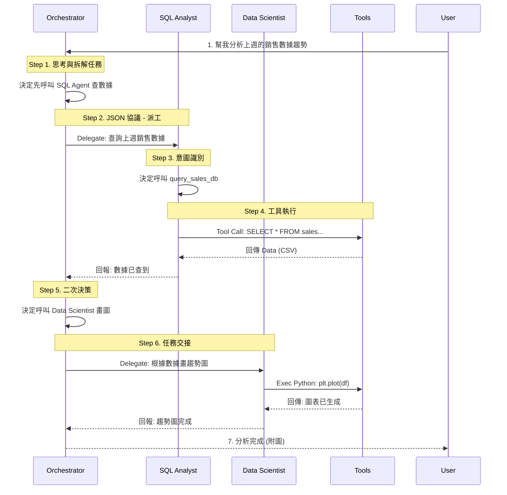

# Data Agent Framework (數據智能體框架)

本專案是一個模組化的**多智能體系統 (Multi-Agent System)**，旨在自動化數據分析任務。採用 **Hub-and-Spoke** 架構，由一個核心協調者 (Orchestrator) 指揮專業代理解決複雜的商業問題。

---

## 🚀 Project Overview (專案簡介)

此框架展示了如何從零建構一個 AI 應用，整合了多種前沿的 AI 工程概念。不僅僅是呼叫 API，而是深入到底層的記憶體管理、工具呼叫協議與安全執行環境。

### ✨ Key Features (核心亮點)
*   **🤖 Multi-Agent Orchestration**: 實作 **A2A (Agent-to-Agent)** 通訊，使用 JSON 協議在 Manager 與 Workers 之間進行精確的任務派發。
*   **🔌 MCP Integration**: 採用 **Model Context Protocol (MCP)** 標準，安全地連接 LLM 與本地資料庫 (SQL) 及外部工具。
*   **🐍 Python Sandbox**: 整合安全的代碼執行環境，讓 Agent 能夠即時撰寫並執行 Python 代碼進行數據視覺化。
*   **🧠 Shared Memory**: 實作了類似 Redis 的持久化 Context Store，讓不同 Agent 能夠共享上下文狀態。

### 🛠️ Tech Stack (技術棧)
*   **Core**: Python 3.10
*   **Model**: Transformers (Qwen-VL-Instruct / Local models)
*   **Patterns**: ReAct, Router Pattern, Tool Calling
*   **Data & Vector**: Pandas, SQLite, FAISS (RAG)

---

## 📂 Repository Structure (專案結構與核心實作)

本倉庫展示了完整的企業級應用模式 (Enterprise AI Patterns)：

### Core Layer (核心基礎)
*   `src/enterprise_data_agent/core/base_agent.py`
    *   **Concept**: **Abstract Base Class**. 定義所有 Agent 共用的 `think` -> `act` 迴圈標準介面。
*   `src/enterprise_data_agent/core/memory.py`
    *   **Concept**: **Context Management**. 實作共享狀態儲存 (Shared State Store)，模擬 Redis 行為以維持對話連貫性。
*   `src/enterprise_data_agent/core/llm.py`
    *   **Concept**: **High-Performance Inference**. 整合 4-bit 量化 (BitsAndBytes) 技術，實現高效的本地模型推論。

### Agents Layer (多智能體協作)
*   `src/enterprise_data_agent/agents/orchestrator.py`
    *   **Concept**: **Router Pattern**. 作為 "Manager"，負責解析自然語言意圖並透過 JSON 協議分派任務。
*   `src/enterprise_data_agent/agents/sql_analyst.py`
    *   **Concept**: **Text-to-SQL**. 專精於將商業問題轉化為 SQL 查詢並透過 MCP 執行。
*   `src/enterprise_data_agent/agents/data_scientist.py`
    *   **Concept**: **Code Interpreter**. 專精於撰寫 Python 代碼進行數據分析與繪圖。

### Services Layer (外部整合)
*   `src/enterprise_data_agent/services/mcp_client.py`
    *   **Concept**: **MCP Client**. 實作標準 MCP 協議以連接外部工具伺服器。
*   `src/enterprise_data_agent/services/python_sandbox.py`
    *   **Concept**: **Sandboxed Execution**. 模擬安全的代碼執行環境。

---

## 📊 Request Lifecycle Visualization (請求全流程圖解)

> **Scenario**: User asks "幫我分析上週的銷售數據趨勢" (Analyze sales trends from last week)

下圖展示了系統如何將模糊的自然語言需求，轉化為精確的程式執行指令：



### 核心邏輯解析 (Core Logic Deep Dive)

1.  **Reasoning & Planning (推理與規劃)**
    *   **Code**: `agents/orchestrator.py`
    *   Orchestrator 根據 Prompt 中的職責定義，推導出執行順序 (CoT)，決定先查數據再畫圖。

2.  **Serialization (協議序列化)**
    *   **Code**: `core/llm.py`
    *   利用 System Prompt 強制模型輸出 JSON 格式 (`{"delegate_to": "SQLAnalyst", ...}`)，將自然語言轉化為程式可解析的結構物件。

3.  **A2A Routing (動態路由)**
    *   **Code**: `run_mission()` in `orchestrator.py`
    *   程式解析 JSON 的 `delegate_to` 欄位，動態呼叫對應 Agent 的 `.process()` 方法，實現自動轉接。

4.  **Feedback Loop (回饋閉環)**
    *   **Code**: `services/mcp_client.py`
    *   工具執行的結果 (如資料庫查詢結果) 會被寫回 Shared Memory，讓 Orchestrator 能感知當前狀態，進而觸發下一步決策。

---

## 💻 How to Run (如何執行)

```bash
# 啟動主程式
python enterprise_data_agent/main.py
```
