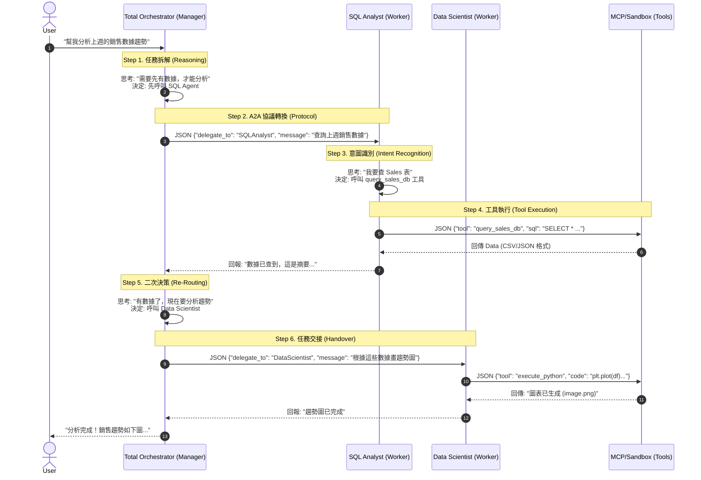

# AI Agent 實作練習

### 📂 Repository Structure & Practice Items (專案結構與練習重點)
This repository is organized to demonstrate Enterprise AI patterns. Below is the detailed breakdown of each file and the concept it practices.
#### `src/enterprise_data_agent/` (Core Framework)
**🧠 Core Layer (核心基礎)**
*   **`core/base_agent.py`**
    *   *Practice*: **Abstract Base Class in AI**.
    *   *Concept*: Defines the standard `think` -> `act` loop used by all agents.
*   **`core/memory.py`**
    *   *Practice*: **Context Management & Persistence**.
    *   *Concept*: Implements a shared state store (like Redis) so agents can share data context without re-prompting.
*   **`core/llm.py`**
    *   *Practice*: **High-Performance Inference**.
    *   *Concept*: Qwen-VL-Instruct integration with **4-bit quantization (BitsAndBytes)** for efficient local execution.
**🤖 Agents Layer (多智能體協作)**
*   **`agents/orchestrator.py`**
    *   *Practice*: **A2A (Agent-to-Agent) & Router Pattern**.
    *   *Concept*: The "Manager" that parses natural language and delegates tasks via JSON protocols.
*   **`agents/sql_analyst.py`**
    *   *Practice*: **MCP Tool Use & Text-to-SQL**.
    *   *Concept*: An agent specialized in converting questions to SQL and executing them via MCP.
*   **`agents/data_scientist.py`**
    *   *Practice*: **Code Interpreter & Tool Calling**.
    *   *Concept*: An agent that writes and executes Python code for data analysis.
**🔌 Services Layer (外部整合)**
*   **`services/mcp_client.py`**
    *   *Practice*: **Model Context Protocol (MCP) Client**.
    *   *Concept*: Implements the standard protocol to connect with external tools (Servers).
*   **`services/python_sandbox.py`**
    *   *Practice*: **Sandboxed Execution**.
    *   *Concept*: Simulates a secure environment for AI-generated code execution.
#### `src/tools/` (External Tools)
*   **`tools/my_mcp_server.py`**
    *   *Practice*: **MCP Server Implementation**.
    *   *Concept*: A standard MCP server exposing SQL capabilities to the agents.


### Enterprise Multi-Agent Data Framework

#### 🚀 Project Overview (專案簡介)
A modular **Multi-Agent System** designed to automate enterprise data analysis tasks. It features a **Hub-and-Spoke architecture** where an Orchestrator coordinates specialized agents (SQL Analyst & Data Scientist) to answer complex business questions.

#### ✨ Key Features (核心亮點)
*   **Multi-Agent Orchestration**: Implemented **A2A (Agent-to-Agent)** communication using JSON protocols to delegate tasks between Manager and Workers.
*   **MCP Integration**: utilizing **Model Context Protocol (MCP)** to securely connect LLMs with local databases.
*   **Python Sandbox**: Integrated a local code execution environment for real-time data visualization.
*   **Shared Memory**: Implemented a persistent context store (Redis-style) for maintaining state across agent interactions.

# AI Agent 協作全流程圖解 (Request Lifecycle Visualization)

這份文檔詳細拆解了「當使用者說一句話時」，系統內部發生的所有訊號傳遞與決策過程。我們以一個經典的跨職能任務為例：

> **User Task**: "幫我分析上週的銷售數據趨勢"

---

## 1. 全流程時序圖 (Sequence Diagram)

這張圖展示了 Orchestrator (經理) 如何將模糊的需求，轉化為精確的 JSON 指令，並指揮 SQL 專家與數據科學家接力完成。



---

## 2. 核心實現邏輯解析 (Core Implementation Logic)

這個流程之所以能跑通，依賴於以下四個關鍵步驟的代碼實現：

### Step 1. 問題拆分與決策 (Reasoning & Planning)
*   **發生點**: `agents/orchestrator.py`
*   **邏輯**: 
    LLM 讀入 User 的自然語言，根據 System Prompt 中的「職責定義」(SQL Agent 負責查，DS Agent 負責畫)，在腦中(CoT) 推導出執行順序。
*   **關鍵**: Orchestrator 不會自己去寫 SQL，它的能力被刻意限制在「分派」。

### Step 2. 轉譯為 JSON 協議 (Serialization)
*   **發生點**: `core/llm.py` (生成) -> `agents/orchestrator.py` (解析)
*   **邏輯**:
    *   **Prompt**: 我們在 Prompt 強制要求 *"Reply with JSON to delegate"*。
    *   **Generation**: LLM 輸出 `{"delegate_to": "SQLAnalyst", ...}` 字串。
    *   **Parsing**: Python 代碼捕捉到這個字串，用 `json.loads()` 把它變成 Python Dictionary，這就是「LLM 聽得懂 -> 程式能執行」的橋樑。

### Step 3. A2A 路由 (Routing)
*   **發生點**: `agents/orchestrator.py` 的 `run_mission()`
*   **邏輯**:
    ```python
    if target == "SQLAnalyst":
        # 這行代碼就是 "路由" 的本體
        await self.sql_agent.process(message)
    ```
    程式根據 JSON 中的 `delegate_to` 欄位，決定呼叫哪一個物件的 `.process()` 方法。這就像是電話總機幫你轉接分機。

### Step 4. 工具執行與回饋 (Execution & Feedback)
*   **發生點**: `services/mcp_client.py`
*   **邏輯**:
    當 SQL Agent 決定要查資料庫時，它同樣輸出一個 JSON。`mcp_client` 負責把這個 JSON 變成標準的 MCP 請求發送給外部 Server。
    *   **閉環 (Loop)**: 最重要的是 **結果回傳**。MCP 的執行結果會被寫回 `SharedMemory`，讓 Orchestrator 能看到「哦！數據查到了」，進而觸發下一步的「分析與畫圖」。

### 總結
整個架構的靈魂在於 **「自然語言 -> JSON -> 函數呼叫 -> 自然語言」** 的不斷循環。這就是 AI Agent 能夠解決複雜問題的本質。


#### 🛠️ Tech Stack (技術棧)
*   **Core**: Python 3.10, Transformers (Qwen-VL-Instruct)
*   **Agentic Patterns**: ReAct, Tool Calling, Router Pattern
*   **Protocols**: MCP (Model Context Protocol)
*   **Data**: Pandas, SQLite, FAISS (RAG)


#### 💻 How to Run (如何執行)
```bash
python enterprise_data_agent/main.py
```

---


