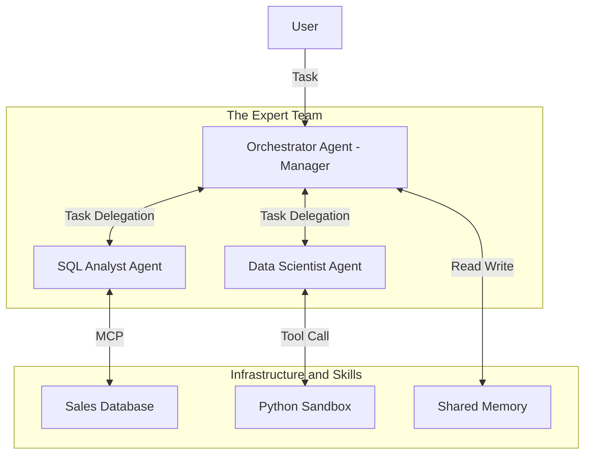

# Enterprise Data Scientist Agent Framework (EDSAF)

這是一個專為企業數據科學團隊設計的 AI Agent 框架。它採用 **Multi-Agent (多智能體)** 架構，模仿真實的數據團隊分工。

## 1. 核心架構 (Architecture)

我們採用 **Hub-and-Spoke (軸輻式)** 架構，由一個「總指揮」負責協調多個「專家 Agent」。



## 2. 角色職責 (Roles)

### (1) Orchestrator (Manager)
-   **職責**: 任務規劃 (Planning)、任務拆解、驗收結果。
-   **能力**:
    -   不直接寫 Code 或查資料。
    -   判斷任務屬性：「這需要查資料庫」-> 呼叫 SQL Agent。
    -   判斷任務屬性：「這需要畫圖」-> 呼叫 Data Scientist Agent。
-   **技術**: 使用 `ReAct` 邏輯或 `LangGraph` 狀態機概念。

### (2) SQL Analyst Agent
-   **職責**: 負責 Text-to-SQL，從資料庫提取數據。
-   **技術**:
    -   透過 **MCP (Model Context Protocol)** 連接到外部資料庫服務 (`my_mcp_server.py`)。
    -   具備 Schema Awareness (知道資料表結構)。

### (3) Data Scientist Agent (Coder)
-   **職責**: 負責數據分析、清洗、視覺化。
-   **技術**:
    -   **Tool Calling**: 擁有一個 `execute_python_code` 的工具。
    -   可以在沙箱 (Sandbox) 中執行 Pandas/Matplotlib。

## 3. 企業級特性 (Enterprise Features)

1.  **Shared Memory (共享記憶)**
    -   所有 Agent 共享同一個 `Session Context`。當 SQL Agent 查出資料後，Data Scientist Agent 立即可以知道資料的概要，不需 User 轉述。
2.  **Structured Output (結構化輸出)**
    -   Agent 之間的溝通不只是聊天的純文字，而是 JSON 格式的 Handover Object (例如 `{"task_id": 1, "data_path": "report.csv"}`)。
3.  **Traceability (可追朔性)**
    -   記錄每一次 Agent 切換 (Handoff) 的原因與過程。

---

## 4. 專案結構 (Directory Structure)

```text
enterprise_data_agent/
├── main.py                 # 入口點
├── config.py               # 設定 (LLM Path, DB Path)
├── core/                   # 基礎建設
│   ├── base_agent.py       # Agent 基類 (定義 speak, think, act)
│   ├── llm.py              # LLM 引擎封裝
│   ├── memory.py           # 共享記憶體實作
│   └── dispatcher.py       # A2A 訊息路由器
├── agents/                 # 具體角色
│   ├── orchestrator.py     # 經理
│   ├── sql_analyst.py      # SQL 專家
│   └── data_scientist.py   # Python 專家
└── services/               # 外部整合
    ├── mcp_client.py       # MCP 連線模組
    └── python_sandbox.py   # Python 執行環境 (Tool)
```
